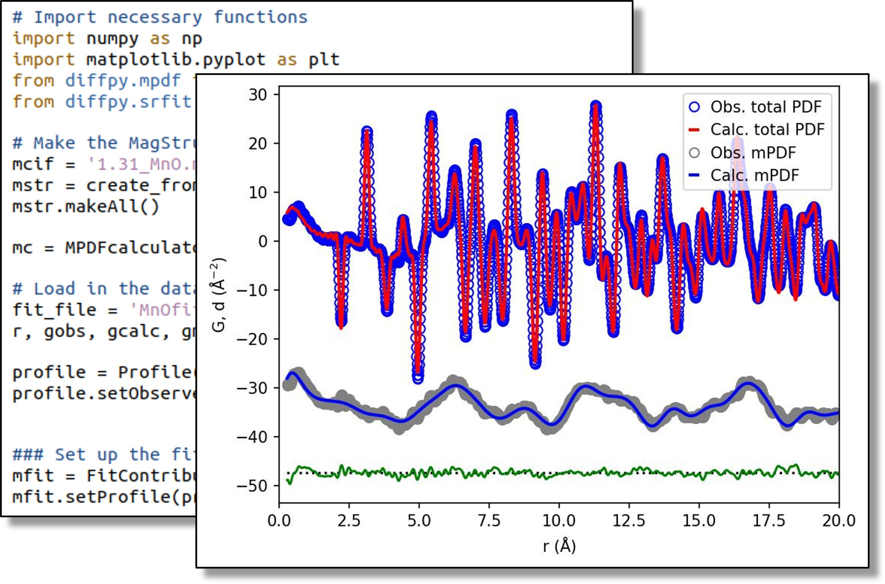

##########
mpdf
##########

.. include:: ../abbreviations.txt

The diffpy.mpdf package provides a convenient method for computing the magnetic PDF
(mPDF) from magnetic structures and performing fits to neutron total scattering
data. The mPDF is calculated by an MPDFcalculator object, which extracts the spin
positions and spin vectors from a MagStructure object that the MPDFcalculator
takes as input. The MagStructure object in turn can contain multiple MagSpecies
objects, which generate magnetic configurations based on a diffpy.structure object
and a set of propagation vectors and basis vectors provided by the user.
Alternatively, the user can manually define a magnetic unit cell that will be used
to generate the magnetic structure, or the magnetic structure can be defined simply
as lists of spin positions and spin vectors provided by the user.

Installation
------------

For installation instructions please see the Frandsen Group diffpy.mdpf 
`GitHub repo <https://github.com/FrandsenGroup/diffpy.mpdf>`

.. toctree::
   :hidden:

   mPDFlicense
